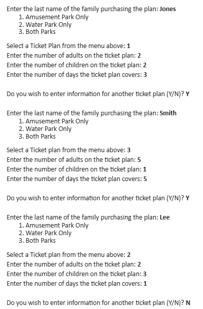
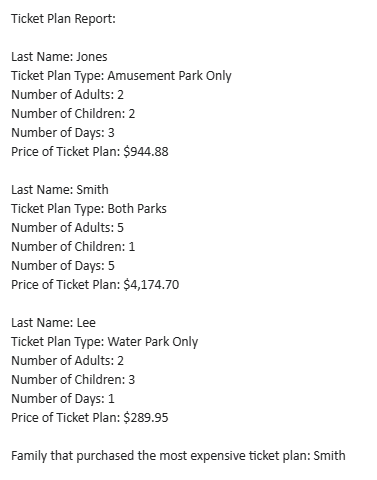

# Special Instructions

1. Use the Scanner class to code this program.
2. Submit only your source code file (i.e., the class you create and the Demo program). Note: a class file you do not create is automatically generated when you run a program. Do not submit this class file.
3. This exam covers concepts in Chapters 1 - 7 only. The use of advanced code from other Chapters will count as a major error.

# Program Description

A vacation resort has both an amusement park and water park facilities for families staying at the resort. The resort sells ticket plans to the families based on which type of park that they would like to visit during their stay. Write a program that will help the resort track ticket plan purchases and calculate ticket plan prices.

Use the following instructions to code the program:

## File 1 - TicketPlan.java

1. Write a TicketPlan class that will hold fields for the following:
   - The last name of the family purchasing the plan
   - The type of Ticket Plan, which can be only one of the following
     - Amusement Park Only
     - Water Park Only
     - Both Parks
   - The number of adults on the ticket plan
   - The number of children on the ticket plan
     The number of days the ticket plan covers

2. The TicketPlan class should also contain the following methods:
   - A constructor that doesn’t accept arguments
   - A constructor that accepts arguments for each field
   - Appropriate accessor and mutator methods (i.e., setters and getters)
   - A method named getCostPerDayAdult that accepts no arguments and calculates and returns the cost per day for an adult on the ticket plan.
     - The cost per day per adult is determined using the information in the table below:

     | Ticket Plan Type    | Number of Days      | Cost Per Day Per Adult |
     | ------------------- | ------------------- | ---------------------- |
     | Amusement Park Only | Up to 4 (inclusive) | $104.99                |
     |                     | More than 4         | $94.99                 |
     | Water Park Only     | Up to 4 (inclusive) | $84.99                 |
     |                     | More than 4         | $79.99                 |
     | Both Parks          | Up to 4 (inclusive) | $169.99                |
     |                     | More than 4         | $149.99                |

   - A method named getCostPerDayChild that accepts no arguments and calculates and returns the cost per day for a child on the ticket plan.
     - The cost per day per child is determined using the information in the table below:

     | Ticket Plan Type    | Number of Children  | Cost Per Day Per Child |
     | ------------------- | ------------------- | ---------------------- |
     | Amusement Park Only | Up to 2 (inclusive) | $52.49                 |
     |                     | More than 2         | $47.49                 |
     | Water Park Only     | Up to 2 (inclusive) | $42.49                 |
     |                     | More than 2         | $39.99                 |
     | Both Parks          | Up to 2 (inclusive) | $84.99                 |
     |                     | More than 2         | $74.99                 |

     IMPORTANT: Be very careful when viewing the information in the tables above. The logic for the cost per child and cost per adult are based on different conditions.

   - A method named getPlanPrice that accepts no arguments and calculates and returns the price of the ticket plan.
     - The price of the plan is calculated using the following formula:
     - Plan Price = ((cost per day per child _ number of children) + (cost per day per adult _ number of adults)) \* number of days

## File 2 - TicketPlanDemo.java

Write a program that demonstrates the TicketPlan class and calculates the cost of ticket plans.

The program should complete the following steps:

1. Ask the user for the following:
   - The last name of the family purchasing the plan.
   - The type of ticket plan. Ticket plan types must be presented in a menu as shown in the Sample Input and Output.
     - Input Validation: Do not accept invalid menu options.
   - The number of adults on the ticket plan.
     - Input Validation: Do not accept a number less than 1 for the number of adults.
   - The number of children on the ticket plan.
     - Input Validation: Do not accept a number less than 0 for the number of children.
   - The number of days the ticket plan covers.
     - Input Validation: Do not accept a number less than 1 for the number of days.

2. The program should create a TicketPlan object using the constructor that accepts arguments.
   - The TicketPlan object should be stored in an ArrayList that keeps track of all TicketPlan objects that are created

3. The program should ask the user whether they want to enter information for another ticket plan, and continue allowing the user to input information until the user indicates to stop (see Sample Input and Output).

4. Once the user indicates they wish to stop, the program should display all information about each ticket plan as shown in the Sample Input and Output.

5. At the very end of the output, the program should display the name of the family that purchased the most expensive ticket plan.

## Sample Input and Output (formatting and spacing should be exactly as shown below)

### Input

### Output

